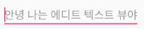
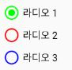
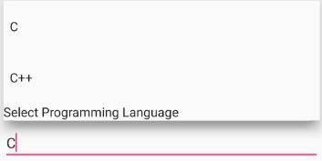
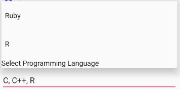

# 안드로이드 기본 위젯 살펴보기
- ## 텍스트뷰 ##
```xml
<TextView
    android:layout_width="wrap_content"
    android:layout_height="wrap_content"
    android:text="안녕 나는 텍스트 뷰야"
    android:textSize="20sp"
    android:textColor="#0000ff"
    android:textStyle="bold"/>
```


- ## 에디트텍스트 ##
```xml
<EditText
    android:layout_width="wrap_content"
    android:layout_height="wrap_content"
    android:hint="안녕 나는 에디트 텍스트 뷰야"/>
```

- ## 버튼 ##
```xml
<Button
    android:layout_width="wrap_content"
    android:layout_height="wrap_content"
    android:text="안녕 나는 버튼이야"/>    
```

- ## 이미지뷰 ##
```xml
<ImageView
    android:layout_width="wrap_content"
    android:layout_height="wrap_content"
    android:src="@mipmap/ic_launcher_round"/>
```

- ## 체크박스 ##
```xml
<CheckBox
        android:layout_width="wrap_content"
        android:layout_height="wrap_content"
        android:text="체크해 주세요"
        android:checked="true"
        android:buttonTint="#00ff00"/>
```

- ## 토글버튼 ##
```xml
<ToggleButton
        android:layout_width="wrap_content"
        android:layout_height="wrap_content"
        android:checked="true"
        android:textOn="사용가능"
        android:textOff="사용불가"/>
```

- ## 스위치 ##
```xml
<Switch
        android:layout_width="wrap_content"
        android:layout_height="wrap_content"
        android:text="스위치입니다"
        android:thumb="@mipmap/ic_launcher"/>
```

- ## 라디오버튼 ##
```xml
    <RadioGroup
        android:layout_width="match_parent"
        android:layout_height="wrap_content">

        <RadioButton
            android:layout_width="wrap_content"
            android:layout_height="wrap_content"
            android:text="라디오 1"
            android:checked="true"
            android:buttonTint="#00ff00"/>

        <RadioButton
            android:layout_width="wrap_content"
            android:layout_height="wrap_content"
            android:text="라디오 2"
            android:buttonTint="#ff0000"/>

        <RadioButton
            android:layout_width="wrap_content"
            android:layout_height="wrap_content"
            android:text="라디오 3"
            android:buttonTint="#0000ff"/>
    </RadioGroup>
```

- ## 스피너 ##
activity_main.xml
```xml
<Spinner
        android:layout_width="wrap_content"
        android:layout_height="wrap_content"
        android:entries="@array/names"/>
```
arrays.xml
```xml
<?xml version="1.0" encoding="utf-8"?>
<resources>
    <string-array name="names">
        <item>홍태준</item>
        <item>이현기</item>
        <item>한운희</item>
        <item>고정환</item>
        <item>임솔빈</item>
    </string-array>
</resources>
```

- ## 시크바 ##
```xml
    <SeekBar
        android:layout_width="200dp"
        android:layout_height="wrap_content"
        android:secondaryProgress="100"
        android:progress="50"
        android:max="150"
        android:thumb="@mipmap/ic_launcher"/>
```

- ## 카드뷰 ##
그래들에 추가
```gradle
compile 'com.android.support:cardview-v7:25.+'
```
CardView Code
```xml
<android.support.v7.widget.CardView
    xmlns:card_view="http://schemas.android.com/apk/res-auto"
    android:layout_width="match_parent"
    android:layout_height="wrap_content"
    android:layout_margin="5dp"
    card_view:contentPadding="5dp"
    card_view:cardElevation="10dp"
    card_view:cardCornerRadius="10dp">

    <LinearLayout
        android:layout_width="match_parent"
        android:layout_height="wrap_content"
        android:orientation="horizontal">

        <TextView
            android:layout_width="wrap_content"
            android:layout_height="wrap_content"
            android:text="입력하세요"/>

        <EditText
            android:layout_width="match_parent"
            android:layout_height="wrap_content"
            android:hint="이름"/>
    </LinearLayout>
</android.support.v7.widget.CardView>
```

- ## 자동완성 텍스트뷰 ##
AutoCompleteTextView Code
```xml 

<android.support.v7.widget.AppCompatAutoCompleteTextView
        android:id="@+id/auto_complete_text_view"
        android:layout_width="match_parent"
        android:layout_height="wrap_content"
        android:completionHint="Select Programming Language"
        android:completionThreshold="1" />
```
MainActivity.java
```java
private String[] items = {"C","C++","Java",".NET","iPhone",
        "Android","ASP.NET","PHP", "JSP", "Ruby", "R"};

@Override
protected void onCreate(Bundle savedInstanceState) {
    super.onCreate(savedInstanceState);
    setContentView(R.layout.activity_main);

    AutoCompleteTextView actv = (AutoCompleteTextView)findViewById(R.id.auto_complete_text_view);
    actv.setAdapter(new ArrayAdapter<>(this,
            android.R.layout.simple_dropdown_item_1line,
            items));
}
```

- ## 멀티 자동완성 텍스트뷰 ##
MultiAutoCompleteTextView Code
```xml 

<android.support.v7.widget.AppCompatMultiAutoCompleteTextView
        android:id="@+id/multi_auto_complete_text_view"
        android:layout_width="match_parent"
        android:layout_height="wrap_content"
        android:completionHint="Select Programming Language"
        android:completionThreshold="1"/>
```
MainActivity.java
```java
private String[] items = {"C","C++","Java",".NET","iPhone",
        "Android","ASP.NET","PHP", "JSP", "Ruby", "R"};

@Override
protected void onCreate(Bundle savedInstanceState) {
    super.onCreate(savedInstanceState);
    setContentView(R.layout.activity_main);

    MultiAutoCompleteTextView mactv = (MultiAutoCompleteTextView)findViewById(R.id.multi_auto_complete_text_view);
    mactv.setAdapter(new ArrayAdapter<>(this,
            android.R.layout.simple_dropdown_item_1line,
            items));
    mactv.setTokenizer(new MultiAutoCompleteTextView.CommaTokenizer());
}
```
