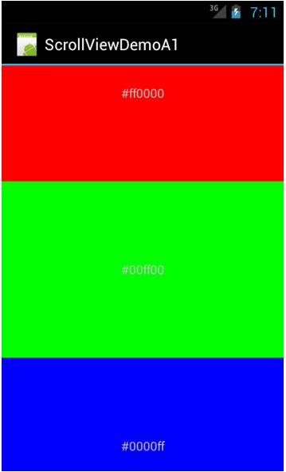

#안드로이드 뷰 컨테이너 살펴보기
- ## 스크롤뷰 ##
```xml
<ScrollView xmlns:android="http://schemas.android.com/apk/res/android"
    android:layout_width="match_parent"
    android:layout_height="wrap_content" >

    <LinearLayout
        android:layout_width="match_parent"
        android:layout_height="match_parent"
        android:orientation="vertical" >

        <TextView
            android:layout_width="match_parent"
            android:layout_height="200dip"
            android:background="#ff0000"
            android:gravity="center"
            android:text="#ff0000" />

        <TextView
            android:layout_width="match_parent"
            android:layout_height="200dip"
            android:background="#00ff00"
            android:gravity="center"
            android:text="#00ff00" />

        <TextView
            android:layout_width="match_parent"
            android:layout_height="200dip"
            android:background="#0000ff"
            android:gravity="center"
            android:text="#0000ff" />
    </LinearLayout>

</ScrollView>
```

- ## 수평 스크롤뷰 ##
```xml
<HorizontalScrollView xmlns:android="http://schemas.android.com/apk/res/android"
    android:layout_width="match_parent"
    android:layout_height="match_parent" >

    <LinearLayout
        android:layout_width="match_parent"
        android:layout_height="match_parent"
        android:orientation="horizontal" >

        <TextView
            android:layout_width="200dip"
            android:layout_height="match_parent"
            android:background="#ff0000"
            android:gravity="center"
            android:text="#ff0000" />

        <TextView
            android:layout_width="200dip"
            android:layout_height="match_parent"
            android:background="#00ff00"
            android:gravity="center"
            android:text="#00ff00" />

        <TextView
            android:layout_width="200dip"
            android:layout_height="match_parent"
            android:background="#0000ff"
            android:gravity="center"
            android:text="#0000ff" />
    </LinearLayout>

</HorizontalScrollView>
```

## 뷰페이저
- 뷰페이저는 옆으로 페이지를 넘기듯이 뷰를 넘길 수 있는 컨테이너이다.
- 주로 TabLayout과 어울려서 사용한다.
- TabLayout을 사용하면 탭을 쉽게 구현할 수 있다.
- 뷰페이저는 PagerAdapter가 필요한데 기본으로 사용할 수 있지만 FragmentPagerAdapter나 FragmentStatePagerAdatper를 사용하는 것이 좋다.
- FragmentStatePagerAdapter는 뷰를 Destroy 하지 않고 저장하고 있는 상태로 유지하기 때문에 이전의 상태로 되돌릴 수 있다.

## 데이트피커
## 타임피커 

## 리사이클러뷰
- 리사이클러뷰는 ListView를 향상시킨 뷰이다. 기존의 ListView의 기능을 모두 포함하고 있다.
- ViewHolder를 사용하여 findViewById의 호출을 줄임으로써 속도를 향상시켰다.
- Item의 삽입, 수정, 삭제시 애니메이션을 손쉽게 추가할 수 있다.
- Item의 Decoration을 추가할 수 있다.
### 종속성 추가
```gradle
dependencies {
    ...
    compile 'com.android.support:cardview-v7:21.0.+'
    compile 'com.android.support:recyclerview-v7:21.0.+'
}
```

### 레이아웃 종류
- LinearLayoutManager: 가로 또는 세로
- GridLayoutManager: 그리드
- StaggeredGridLayoutManager: 지그재그형 그리드

### 애니메이션
- RecyclerView.ItemAnimator
