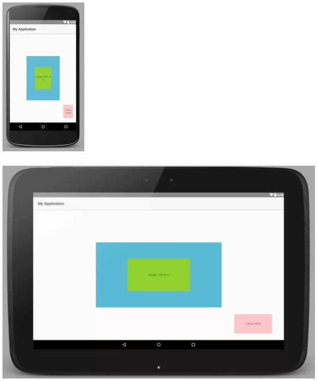

# 안드로이드 레이아웃 살펴보기 #
- ## 프레임 레이아웃 ##
	- 뷰들을 왼쪽 상단을 기준으로 배치하는 레이아웃이다. 배치 순서에 따라서 뷰들이 오버랩된다.
	- Gravity 속성을 사용하여 뷰의 위치를 조절할 수 있다.
- ## 리니어 레이아웃 ##
	- 선형으로 뷰들을 관리하는 레이아웃이다.
	- Orientation 속성을 설정할 수 있으며 Weight로 공간을 비율로 차지하게 할 수 있다.
		- Vertical vs Horizontal
		- layout_weight="?"
- ## 릴레티브 레이아웃 ##
	- 상대적인 위치를 기반으로 뷰들을 배치하는 레이아웃이다. 어떤 뷰의 왼쪽에 배치하거나 아래에 배치하는 방식으로 뷰를 배치할 수 있다.
		- layout_toRightOf="@+id/?"
		- layout_below="@+id/?"
		- layout_alignParentRight="true"
- ## 컨스트레인트 레이아웃 ##

- ## 퍼센트 레이아웃 ##
	- PercentFrameLayout
	- PercentRelativeLayout
	- 속성
		- heightPercent
		- widthPercent
		- marginBottomPercent
		- marginEndPercent
		- marginLeftPercent
		- marginPercent
		- marginRightPercent
		- marginStartPercent
		- marginTopPercent
```gradle
compile 'com.android.support:percent:25.+'
```
```xml
<android.support.percent.PercentFrameLayout
    xmlns:android="http://schemas.android.com/apk/res/android"
    xmlns:app="http://schemas.android.com/apk/res-auto"
    android:layout_width="match_parent"
    android:layout_height="match_parent"
    android:orientation="vertical">

    <android.support.percent.PercentFrameLayout
        android:layout_width="0dp"
        android:layout_height="0dp"
        android:layout_gravity="center"
        android:background="#ff44aacc"
        app:layout_heightPercent="50%"
        app:layout_widthPercent="50%">

        <android.support.percent.PercentFrameLayout
            android:layout_width="0dp"
            android:layout_height="0dp"
            android:layout_gravity="center"
            android:background="#ffcc5ec7"
            app:layout_heightPercent="50%"
            app:layout_widthPercent="50%">

            <TextView
                android:layout_width="match_parent"
                android:layout_height="match_parent"
                android:layout_gravity="center"
                android:background="#ff7ecc16"
                android:gravity="center"
                android:text="margin 15% of w"
                />

        </android.support.percent.PercentFrameLayout>

    </android.support.percent.PercentFrameLayout>

    <TextView android:layout_width="0dp"
        android:layout_height="0dp"
        android:layout_gravity="bottom|right"
        android:background="#44ff0000"
        android:gravity="center"
        android:text="15%w,15%w"
        app:layout_heightPercent="15%"
        app:layout_marginPercent="5%"
        app:layout_widthPercent="15%"/>


</android.support.percent.PercentFrameLayout>
```
