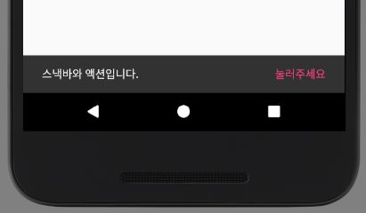

# 알림 기능 살펴보기
## 토스트
사용자에게 간단한 피드백을 제공할 수 있는 팝업이다. 그 순간에만 필요한 내용일 경우에만 사용한다.


만일 오랫동안 유지해야하는 내용일 경우에는 [Notification](https://developer.android.com/guide/topics/ui/notifiers/notifications.html)을 사용하는 것이 좋다.

### 기본적인 사용 방법
```java
Toast.makeText(context, text, duration).show();
```

1. context: 컨텍스트 (Context)
2. text: 메시지 내용 (String)
3. duration: 메시지 지속 시간 (LENGTH_SHORT / LENGTH_LONG)

### 토스트 위치 변환하기
```java
toast.setGravity(Gravity.TOP|Gravity.LEFT, 0, 0);
```

1. gravity: 토스트 위치 설정
2. xOffset: x 좌표 이동 거리
3. yOffset: y 좌표 이동 거리

### 토스트 커스텀화 하기
```java
// 레이아웃 생성
LayoutInflater inflater = getLayoutInflater();
View layout = inflater.inflate(R.layout.custom_toast,
                (ViewGroup) findViewById(R.id.custom_toast_container));
// 레이아웃 설정
TextView text = (TextView) layout.findViewById(R.id.text);
text.setText("This is a custom toast");
// 토스트 설정
Toast toast = new Toast(getApplicationContext());
toast.setGravity(Gravity.CENTER_VERTICAL, 0, 0);
toast.setDuration(Toast.LENGTH_LONG);
toast.setView(layout);
toast.show();
```

#### setView(View view)
view를 inflate하여 설정해줄 수 있다.

## 스낵바
스낵바는 가볍게 피드백을 제공할 수 있다. 짧은 메시지를 화면 하단에 띄워준다.<br>
스낵바는 모든 요소 보다 상단에 존재하며 단 하나만 보여지게 된다.<br>
정해진 타임아웃 시간에 맞춰서 스낵바는 다시 사라진다.<br>
스낵바는 setAction을 통해서 버튼을 추가할 수 있다. 그리고 버튼이 눌렸을 경우의 행동 또한 콜백을 달 수 있다.<br>



### 사용방법
- gradle 추가
```gradle
compile 'com.android.support:design:25.+'
```
- 띄우기
```java
Snackbar.make(linearLayout, "스낵바 입니다", Snackbar.LENGTH_SHORT).show();
```
- 액션 설정하기
```java
Snackbar.make(linearLayout, "스낵바와 액션입니다.", Snackbar.LENGTH_LONG)
        .setAction("눌러주세요", new View.OnClickListener() {
            @Override
            public void onClick(View v) {
            }
        }).show();
``` 
## 대화상자(Dialog)
[참조사이트](https://developer.android.com/guide/topics/ui/dialogs.html?hl=ko)

대화상자는 사용자에게 결정을 내리거나 추가 정보를 입력하라는 프롬프트를 보내는 작은 창이다. 대화상자는 화면을 가득 채우지 않으며 보통 사용자가 다음으로 계속 진행하기 전에 조취를 취해야 하는 모달 이벤트에 사용됩니다.


Dialog클래스가 대화상자의 기본 클래스이지만, Dialog를 직접 인스턴트화하는 것은 삼가야 한다.

### 인스턴스화할 수 있는 서브클래스
1. AlertDialog
2. DatePickerDialog
3. TimePickerDialog

이들을 사용하여 대화상자를 만들 수 있지만 생명주기를 관리하기 위해서 컨테이너로 DialogFragment를 사용하는 것이 좋다.

### DialogFragment 예시
```java
public class FireMissilesDialogFragment extends DialogFragment {
    @Override
    public Dialog onCreateDialog(Bundle savedInstanceState) {
        // Use the Builder class for convenient dialog construction
        AlertDialog.Builder builder = new AlertDialog.Builder(getActivity());
        builder.setMessage(R.string.dialog_fire_missiles)
               .setPositiveButton(R.string.fire, new DialogInterface.OnClickListener() {
                   public void onClick(DialogInterface dialog, int id) {
                       // FIRE ZE MISSILES!
                   }
               })
               .setNegativeButton(R.string.cancel, new DialogInterface.OnClickListener() {
                   public void onClick(DialogInterface dialog, int id) {
                       // User cancelled the dialog
                   }
               });
        // Create the AlertDialog object and return it
        return builder.create();
    }
}
```

### AlertDialog
#### 기본 빌드
```java
// 1. 빌더를 생성자로 초기화합니다.
AlertDialog.Builder builder = new AlertDialog.Builder(getActivity());
// 2. 메소드를 모두 연결하여 setter 메소드로 다이얼로그 특성들을 설정합니다.
builder.setMessage(R.string.dialog_message)
       .setTitle(R.string.dialog_title);
// 3. create()함수로 다이얼로그를 얻습니다.
AlertDialog dialog = builder.create();
```

#### 버튼 추가
```java
builder.setPositiveButton(R.string.ok, new DialogInterface.OnClickListener() {
           public void onClick(DialogInterface dialog, int id) {
               // User clicked OK button
           }
       });
builder.setNegativeButton(R.string.cancel, new DialogInterface.OnClickListener() {
           public void onClick(DialogInterface dialog, int id) {
               // User cancelled the dialog
           }
       });
```

1. Positive: 수락하여 작업을 계속하는 데 사용한다. (OK)
2. Negative: 작업을 취소하는 데 사용한다
3. Neautral: 어중간한 작업에 사용한다. 예를 들면 Remind me later가 있다.

#### 목록 추가
1. 일반적인 단일 선택
```java
@Override
public Dialog onCreateDialog(Bundle savedInstanceState) {
    AlertDialog.Builder builder = new AlertDialog.Builder(getActivity());
    builder.setTitle(R.string.pick_color)
           .setItems(R.array.colors_array, new DialogInterface.OnClickListener() {
               public void onClick(DialogInterface dialog, int which) {
               // The 'which' argument contains the index position
               // of the selected item
           }
    });
    return builder.create();
}
```
2. 라디오 버튼
```java
setSingleChoiceItems()
```
3. 체크박스
```java
setMultiChoiceItems()
```

**이후 DialogFragment에 관한 내용이 많이 있는데 참조사이트에서 확인하는 것이 좋다.**

## 통지(Notification)
[참조사이트](https://developer.android.com/guide/topics/ui/dialogs.html?hl=ko)

알림은 애플리케이션의 정상 UI 외부에서 사용자에게 표시할 수 있는 메시지입니다. 시스템에 알림을 실행하라고 명령하면 처음에 알림 영역에서 아이콘으로 나타납니다. 알림 세부 정보를 보려면 사용자는 알림 창을 열어야 합니다. 알림 영역과 알림 창은 사용자가 언제든 볼 수 있는, 시스템이 제어하는 영역입니다.


### 알림 생성 과정
1. NotificationCompat.Builder 개체에서 알림에 대한 UI 정보와 작업을 지정합니다.
2. 알림 자체를 생성하려면 NotificationCompat.Builder.build()를 호출합니다.
3.  알림을 발행하려면 NotificationManager.notify()를 호출해서 시스템에 Notification 객체를 전달합니다.

### 필수 알림 콘텐츠
- setSmallIcon()
- setContentTitle()
- setContentText()

### 알림으로 할 수 있는 작업
- 기본적으로 알림을 클릭하면 애플리케이션의 Activity를 연다.
- 알림 하단에 추가 작업 버튼을 추가할 수 있다.
- Intent가 포함된 PendingIntent를 정의하여 setContentIntent()를 호출하여 추가한다.

### 알림 우선 순위
- PRIORITY_MIN(-2) ~ PRIORITY_MAX(2) 총 5가지가 있다.
- setPriority()를 호출하여 설정할 수 있다.
- Default는 0이다

### 단순한 알림 만들기
```java
NotificationCompat.Builder mBuilder =
        new NotificationCompat.Builder(this)
        .setSmallIcon(R.drawable.notification_icon)
        .setContentTitle("My notification")
        .setContentText("Hello World!");
// Creates an explicit intent for an Activity in your app
Intent resultIntent = new Intent(this, ResultActivity.class);
// Get Notification Manager
NotificationManager mNotificationManager =
    (NotificationManager) getSystemService(Context.NOTIFICATION_SERVICE);
// mId allows you to update the notification later on.
mNotificationManager.notify(mId, mBuilder.build());
```

### 알림 업데이트
- NotifyManager.notify(id, notification)에서 id값을 동일하게 주면 알림을 업데이트시켜준다.
- Notification.Builder에서 setNumber를 호출하여 숫자를 지정해주면 알림을 쌓아 요약을 표시해준다.

### 알림 제거
- 사용자가 직접 제거
- 사용자가 알림을 클릭하였을 때 setAutoCancel()에 의해 제거
- 특정 알림 ID에 대해 cancel()
- cancelAll()로 모든 알림 제거

### 탐색 보존
메시지를 작성하고 있다가 알림을 클릭하여 이동한 경우 그 상태에서 뒤로가기를 누르면 메시지 작성화면이 아닌 메인으로 돌아가게끔 해줌

### 정규 액티비티 PendingIntent 설정
액티비티의 부모 액티비티를 지정해주는 방법을 설명함. TaskStackBuilder를 사용하여 addParentStack과 aaddNextIntent를 호출한다.

### 진행 상태 표시
- setProgress(max, progress, indeterminate)
- indeterminate를 false하면 특정 기간동안에만 보여지고 사라진다. true를 하면 계속적으로 남아있다. 

### 헤드업 알림

### 잠금 화면 알림
- 가시성 설정
	1. VISIBILITY_PUBLIC: 모두 공개
	2. VISIBILITY_SECRET: 표시 안함
	3. VISIBILITY_PRIVATE: 일부 공개

### 미디어 재생 제어

### 사용자 지정