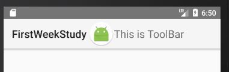

# 툴바와 프래그먼트 그리고 머티리얼디자인 살펴보기
## 툴바의 이해
[참고사이트1](https://developer.android.com/reference/android/support/v7/widget/Toolbar.html)<br>
[참고사이트2](https://guides.codepath.com/android/Using-the-App-Toolbar)<br>

### 기본 내용
 툴바는 액션바를 일반화하여 앱 레이아웃 내부에서 사용할 수 있도록 만든 것이다. 액션바는 액티비티의 창을 장식하는 컨트롤 장치중 하나지만 툴바는 여러 용도로 뷰 내부에 존재할 수 있다. 툴바를 액션바로 사용하려면 setSupportActionBar() 메소드를 사용하면 된다.

### 툴바의 특징
1. 네비게이션 버튼
2. 브랜드 로고 이미지
3. 제목 및 부제목
4. 하나 이상의 커스텀 뷰
5. 액션 메뉴 

### 툴바 생성
#### XML Code
```xml
<android.support.v7.widget.Toolbar
    android:layout_width="match_parent"
    android:layout_height="wrap_content"
    android:background="@color/colorPrimary">
	// 이미지뷰
    <ImageView
        android:layout_width="wrap_content"
        android:layout_height="wrap_content"
        android:src="@mipmap/ic_launcher_round"/>
	// 텍스트뷰
    <TextView
        android:layout_width="wrap_content"
        android:layout_height="wrap_content"
        android:text="This is ToolBar"
        android:textColor="#ffffff"
        android:textSize="20sp"/>
</android.support.v7.widget.Toolbar>
```


### 툴바의 패딩
툴바는 기본적으로 양옆, 위아래에 Padding이 존재한다. 이를 없애주기 위해서 속성을 추가해주어야한다.
```xml
xmlns:app="http://schemas.android.com/apk/res-auto"
app:contentInsetStart="0dp"
app:contentInsetEnd="0dp"
```

### App bar로 사용하기
툴바는 앱바로 사용할 수 있다. 앱바로 사용하기 위해서 기본적인 속성을 추가해주어야 한다.

1. 매니페스트의 어플리케이션 속성을 추가해준다.
```xml
<application
    android:theme="@style/Theme.AppCompat.Light.NoActionBar"
    />
```
2. Activity에서 메소드를 호출한다.
```java
@Override
protected void onCreate(Bundle savedInstanceState) {
    super.onCreate(savedInstanceState);
    setContentView(R.layout.activity_main);
    Toolbar toolbar = (Toolbar)findViewById(R.id.tool_bar);
    setSupportActionBar(toolbar);
}
```

#### App bar에서 사용가능한 메소드들
- getSupportActionBar().setDisplayShowTitleEnabled(false); // 타이틀 삭제
- getSupportActionBar().setDisplayUseLogoEnabled(true); // 로고 활성화
- getSupportActionBar().setLogo(resource); // 로고 설정

### 툴바의 부가 기능
#### Navigation Drawer와 함께 어울리기
- DrawerLayout
- ActionBarDrawerToggle
#### Menu와 함께 어울리기 
- setSupportActionBar()
- onCreateOptionsMenu()
- onOptionsItemSelected()
#### 앱바 숨기기
- 숨길 툴바 속성
```xml
app:layout_scrollFlags="scroll|enterAlways"
```
- 위치가 함께 옮겨질 뷰의 속성
```xml
app:layout_behavior="android.support.design.widget.AppBarLayout$ScrollingViewBehavior"
```
- 반드시 CoordinatorLayout안에 툴바와 옮겨질 뷰가 들어가 있어야 한다!

## 프래그먼트의 이해
[참조사이트](https://developer.android.com/guide/components/fragments.html?hl=ko)<br>
### 프래그먼트 특징
- 프래그먼트는 액티비티 내에서 사용자 인터페이스의 일부를 나타낸다
- 여러개의 프래그먼트를 하나의 액티비티에 조합하여 창이 여러 개인 UI를 구축할 수 있다.
- 하나의 프래그먼트를 여러 액티비티에서 재사용할 수 있습니다.
- 프래그먼트는 자체 수명 주기를 가지고, 자체 입력 이벤트를 받으며, 액티비티 실행 중에 추가 및 제거가 가능하다.
- 작은 액티비티와 같은 개념
- 항상 액티비티 내에 포함되어 있어야 한다.
- 액티비티의 생명 주기에 직접적으로 영향을 받는다.
### 프래그먼트 생명주기


- onAttach(): 프래그먼트가 액티비티와 연관되어 있었던 경우 호출됩니다(여기에서 Activity가 전달됩니다).
- onCreateView(): 프래그먼트와 연관된 뷰 계층을 생성하기 위해 호출됩니다.
- onActivityCreated(): 액티비티의 onCreate() 메서드가 반환되면 호출됩니다.
- onDestroyView(): 프래그먼트와 연관된 뷰 계층이 제거되는 중일 때 호출됩니다.
- onDetach(): 프래그먼트가 액티비티와 연결이 끊어지는 중일 때 호출됩니다.
### 사용자 인터페이스 추가
```java
public static class ExampleFragment extends Fragment {
    @Override
    public View onCreateView(LayoutInflater inflater, ViewGroup container,
                             Bundle savedInstanceState) {
        // Inflate the layout for this fragment
        return inflater.inflate(R.layout.example_fragment, container, false);
    }
}
```

### 액티비티에 프래그먼트 추가 방법
1. 레이아웃 파일 안에서 선언하기
```xml
<?xml version="1.0" encoding="utf-8"?>
<LinearLayout xmlns:android="http://schemas.android.com/apk/res/android"
    android:orientation="horizontal"
    android:layout_width="match_parent"
    android:layout_height="match_parent">
    <fragment android:name="com.example.news.ArticleListFragment"
            android:id="@+id/list"
            android:layout_weight="1"
            android:layout_width="0dp"
            android:layout_height="match_parent" />
    <fragment android:name="com.example.news.ArticleReaderFragment"
            android:id="@+id/viewer"
            android:layout_weight="2"
            android:layout_width="0dp"
            android:layout_height="match_parent" />
</LinearLayout>
```
2. 프로그래밍 방식으로 ViewGroup에 추가하기
```java
FragmentManager fragmentManager = getFragmentManager();
FragmentTransaction fragmentTransaction = fragmentManager.beginTransaction();
ExampleFragment fragment = new ExampleFragment();
fragmentTransaction.add(R.id.fragment_container, fragment);
fragmentTransaction.commit();
```

### 프래그먼트 관리 방법
- 액티비티 내에 존재하는 프래그먼트를 가져오려면 FragmentManager를 받아와서 findFragmentById() 메소드 또는 findFragmentByTag()를 호출하면 된다.
- FragmentManager의 popBackStack() 메소드를 사용하여 프래그먼트를 백 스택에서 꺼낼 수 있다.
- 백 스택이 변경되었는지를 감지하기 위해서 addOnBackStackChangedListner() 메소드로 리스너를 등록한다.

### 프래그먼트 트랜잭션
- 액티비티에서 프래그먼트를 사용하는 경우 특히 유용한 점은 사용자 상호작용에 응답하여 추가, 제거, 교체 및 다른 작업을 수행할 수 있다는 것이다.
- 트랜잭션은 액티비티에 커밋한 변경 내용의 집합이다. 이를 수행하려면 FragmentTransaction을 사용하면 된다.
- 트랜잭션을 액티비티가 관리하는 백 스택에 저장할 수 있다. 그러면 사용자가 프래그먼트의 변경 내역을 거쳐 되돌릴 수 있다.
- commit()을 호출하면 트랜잭션을 액티비티에 적용시킨다. commit()을 호출하기 전 addToBackStack()을 호출해야 백 스택에 추가되고 이전 프래그먼트 상태로 되돌아갈 수 있도록 해준다.

### 액티비티와의 통신
- 프래그먼트는 액티비티에 직접적으로 연결되어있다. 따라서 getActivity()를 사용하여 액티비티와의 상호작용을 손쉽게 할 수 있다.
```java
View listView = getActivity().findViewById(R.id.list);
```
- 액티비티에서도 프래그먼트 안의 메서드를 호출 할 수 있다.
```java
Fragment fragment = getFragmentManager().findFragmentById(R.id.fragment);
```
#### 액티비티로의 이벤트 콜백 생성 방법
- 프래그먼트 내부의 콜백 인터페이스를 정의한 다음 해당 호스트 액티비티가 이를 구현하도록 하는 것이 좋다.
- 다음은 프래그먼트의 콜백 인터페이스 코드 예시이다.
```java
public static class FragmentA extends ListFragment {
    ...
    // Container Activity must implement this interface
    public interface OnArticleSelectedListener {
        public void onArticleSelected(Uri articleUri);
    }
    ...
}
```
- 다음은 호스트 액티비티의 리스너를 전달받는 코드 예시이다.
```java
public static class FragmentA extends ListFragment {
    OnArticleSelectedListener mListener;
    ...
    @Override
    public void onAttach(Activity activity) {
        super.onAttach(activity);
        try {
            mListener = (OnArticleSelectedListener) activity;
        } catch (ClassCastException e) {
            throw new ClassCastException(activity.toString() + " must implement OnArticleSelectedListener");
        }
    }
    ...
}
```
- 실제 콜백 메소드를 발생시키는 코드 예시이다.
```java
public static class FragmentA extends ListFragment {
    OnArticleSelectedListener mListener;
    ...
    @Override
    public void onListItemClick(ListView l, View v, int position, long id) {
        // Append the clicked item's row ID with the content provider Uri
        Uri noteUri = ContentUris.withAppendedId(ArticleColumns.CONTENT_URI, id);
        // Send the event and Uri to the host activity
        mListener.onArticleSelected(noteUri);
    }
    ...
}
```
### 앱 바에 항목 추가
- 프래그먼트는 액티비티의 앱 바에도 메뉴 항목을 추가할 수 있다.
- onCreate()에서 setHasOptionsMenu()를 설정해주고 onCreateOptionsMenu()를 구현하면 된다.
- 메뉴 항목 성택 이벤트 또한 onOptionsItemSelected() 콜백으로 수신한다.
## 프래그먼트를 활용한 화면 구성


## CoordinatorLayout, CollapsingToolbarLayout
- CoordinatorLayout은 아주 강력한 FrameLayout이라고 볼 수 있다.
- CoordinatorLayout은 앱의 최상위 장식 레이아웃으로써 사용한다.
- 또는 하나 이상의 자식 뷰와 특별한 상호작용을 하기 위한 컨테이너로써 사용한다.(대표적으로 Collapsing, Behavior)
- CollapsingToolbarLayout은 대표적으로 CoordinatorLayout과 상호작용하는 레이아웃이다.
### 사용할 수 있는 기능
- [참조사이트](http://saulmm.github.io/mastering-coordinator)
- 스크롤링할 때 behavior로 지정한 뷰 사라지게 / 나타나게 하기
- 스와이프하면 사라지게하기
## 머티리얼 디자인의 이해
- [참조사이트](http://davidlab.net/google-design-ko/material-design/introduction.html#)
- 정리할 수 없음.. 참조사이트를 한번 훑어보는 것이 나음