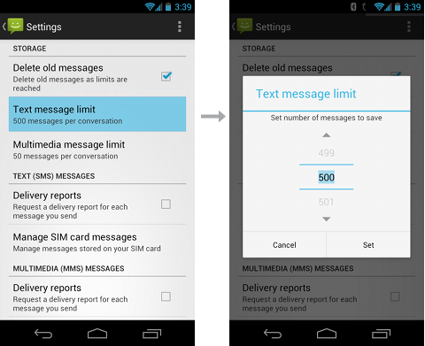

# 안드로이드 저장소 살펴보기
## 프리퍼런스(Preference) 활용
- [참고사이트](https://developer.android.com/guide/topics/ui/settings.html?hl=ko)
- 안드로이드의 Preference API를 사용하면 시스템 설정과 일관성을 유지하는 인터페이스를 구축할 수 있도록 도와준다.
- 사용자 인터페이스를 구축할 때에는 View 객체를 사용하지만 설정에서는 Preference 클래스의 다양한 서브 클래스를 사용하여 구축한다.
- 기본적으로 PreferenceActivity를 사용한다.



### Preference 하위 클래스
- CheckBoxPreference
- ListPreference
- EditTextPreference

### UI 구현 방법
- Preference를 사용하기 위해서는 상위에 PreferenceScreen가 존재해야한다.
- 아래 xml코드는 Preference 사용 예시이다.
```xml
<PreferenceScreen xmlns:android="http://schemas.android.com/apk/res/android">
    <CheckBoxPreference
        android:key="pref_sync"
        android:title="@string/pref_sync"
        android:summary="@string/pref_sync_summ"
        android:defaultValue="true" />
    <ListPreference
        android:dependency="pref_sync"
        android:key="pref_syncConnectionType"
        android:title="@string/pref_syncConnectionType"
        android:dialogTitle="@string/pref_syncConnectionType"
        android:entries="@array/pref_syncConnectionTypes_entries"
        android:entryValues="@array/pref_syncConnectionTypes_values"
        android:defaultValue="@string/pref_syncConnectionTypes_default" />
</PreferenceScreen>
```

**android:key**<br>
 데이터 값을 유지하는 필수 속성입니다. SharedPreferences에 이 설정의 값을 저장할 때 고유 키로 지정합니다.<br>
**android:title**<br>
 사용자가 볼 수 있는 설정의 이름을 제공합니다.<br>
**android:defaultValue**<br>
 SharedPreferences 파일에 설정해야 하는 초기 값을 지정합니다.<br>

#### 그룹화 하기
- 설정이 많아지면 그룹화를 해야할 필요가 있다.
- 제목 사용 방법
	- PreferenceCategory를 xml 내부에 배치한다.
	- 아래는 사용 예시 코드이다.
```xml
<PreferenceScreen xmlns:android="http://schemas.android.com/apk/res/android">
    <PreferenceCategory
        android:title="@string/pref_sms_storage_title"
        android:key="pref_key_storage_settings">
        <CheckBoxPreference
            android:key="pref_key_auto_delete"
            android:summary="@string/pref_summary_auto_delete"
            android:title="@string/pref_title_auto_delete"
            android:defaultValue="false"... />
        <Preference
            android:key="pref_key_sms_delete_limit"
            android:dependency="pref_key_auto_delete"
            android:summary="@string/pref_summary_delete_limit"
            android:title="@string/pref_title_sms_delete"... />
        <Preference
            android:key="pref_key_mms_delete_limit"
            android:dependency="pref_key_auto_delete"
            android:summary="@string/pref_summary_delete_limit"
            android:title="@string/pref_title_mms_delete" ... />
    </PreferenceCategory>
    ...
</PreferenceScreen>
```
- 보조 화면 사용 방법
	- PreferenceScreen을 여러개 사용한다.
	- 아래는 사용 예시 코드이다.
```xml
<PreferenceScreen  xmlns:android="http://schemas.android.com/apk/res/android">
    <!-- opens a subscreen of settings -->
    <PreferenceScreen
        android:key="button_voicemail_category_key"
        android:title="@string/voicemail"
        android:persistent="false">
        <ListPreference
            android:key="button_voicemail_provider_key"
            android:title="@string/voicemail_provider" ... />
        <!-- opens another nested subscreen -->
        <PreferenceScreen
            android:key="button_voicemail_setting_key"
            android:title="@string/voicemail_settings"
            android:persistent="false">
            ...
        </PreferenceScreen>
        <RingtonePreference
            android:key="button_voicemail_ringtone_key"
            android:title="@string/voicemail_ringtone_title"
            android:ringtoneType="notification" ... />
        ...
    </PreferenceScreen>
    ...
</PreferenceScreen>
```

### SharedPreference 사용 방법

```java
public class Calc extends Activity {
    public static final String PREFS_NAME = "MyPrefsFile";

    @Override
    protected void onCreate(Bundle state){
       super.onCreate(state);
       . . .

       // Restore preferences
       SharedPreferences settings = getSharedPreferences(PREFS_NAME, 0);
       boolean silent = settings.getBoolean("silentMode", false);
       setSilent(silent);
    }

    @Override
    protected void onStop(){
       super.onStop();

      // We need an Editor object to make preference changes.
      // All objects are from android.context.Context
      SharedPreferences settings = getSharedPreferences(PREFS_NAME, 0);
      SharedPreferences.Editor editor = settings.edit();
      editor.putBoolean("silentMode", mSilentMode);

      // Commit the edits!
      editor.commit();
    }
}
```

## 파일 활용
- [참고사이트](https://developer.android.com/guide/topics/data/data-storage.html?hl=ko#filesInternal)

## 데이터베이스(SQLite) 활용
- [참고사이트](https://developer.android.com/training/basics/data-storage/databases.html?hl=ko)
- 데이터베이스 사용 순서
	1. 스키마 및 계약의 정의
	2. SQL Helper를 사용하여 데이터베이스 생성
	3. 데이터베이스 정보 삽입/ 삭제/ 수정/ 읽기

### 스키마 및 계약의 정의

```java
public final class FeedReaderContract {
    // To prevent someone from accidentally instantiating the contract class,
    // make the constructor private.
    private FeedReaderContract() {}
    /* Inner class that defines the table contents */
    public static class FeedEntry implements BaseColumns {
        public static final String TABLE_NAME = "entry";
        public static final String COLUMN_NAME_TITLE = "title";
        public static final String COLUMN_NAME_SUBTITLE = "subtitle";
    }
}
```

- 테이블 명: entry
- 칼럼: title, subtitle

### 데이터베이스 생성

```java
private static final String TEXT_TYPE = " TEXT";
private static final String COMMA_SEP = ",";
private static final String SQL_CREATE_ENTRIES =
    "CREATE TABLE " + FeedEntry.TABLE_NAME + " (" +
    FeedEntry._ID + " INTEGER PRIMARY KEY," +
    FeedEntry.COLUMN_NAME_TITLE + TEXT_TYPE + COMMA_SEP +
    FeedEntry.COLUMN_NAME_SUBTITLE + TEXT_TYPE + " )";
private static final String SQL_DELETE_ENTRIES =
    "DROP TABLE IF EXISTS " + FeedEntry.TABLE_NAME;
```

```java
public class FeedReaderDbHelper extends SQLiteOpenHelper {
    // If you change the database schema, you must increment the database version.
    public static final int DATABASE_VERSION = 1;
    public static final String DATABASE_NAME = "FeedReader.db";
    public FeedReaderDbHelper(Context context) {
        super(context, DATABASE_NAME, null, DATABASE_VERSION);
    }
    public void onCreate(SQLiteDatabase db) {
        db.execSQL(SQL_CREATE_ENTRIES);
    }
    public void onUpgrade(SQLiteDatabase db, int oldVersion, int newVersion) {
        // This database is only a cache for online data, so its upgrade policy is
        // to simply to discard the data and start over
        db.execSQL(SQL_DELETE_ENTRIES);
        onCreate(db);
    }
    public void onDowngrade(SQLiteDatabase db, int oldVersion, int newVersion) {
        onUpgrade(db, oldVersion, newVersion);
    }
}
```

```java
FeedReaderDbHelper mDbHelper = new FeedReaderDbHelper(getContext());
```

### 정보 삽입

```java
// Gets the data repository in write mode
SQLiteDatabase db = mDbHelper.getWritableDatabase();
// Create a new map of values, where column names are the keys
ContentValues values = new ContentValues();
values.put(FeedEntry.COLUMN_NAME_TITLE, title);
values.put(FeedEntry.COLUMN_NAME_SUBTITLE, subtitle);
// Insert the new row, returning the primary key value of the new row
long newRowId = db.insert(FeedEntry.TABLE_NAME, null, values);
```

### 정보 읽기

```java
SQLiteDatabase db = mDbHelper.getReadableDatabase();
// Define a projection that specifies which columns from the database
// you will actually use after this query.
String[] projection = {
    FeedEntry._ID,
    FeedEntry.COLUMN_NAME_TITLE,
    FeedEntry.COLUMN_NAME_SUBTITLE
    };
// Filter results WHERE "title" = 'My Title'
String selection = FeedEntry.COLUMN_NAME_TITLE + " = ?";
String[] selectionArgs = { "My Title" };
// How you want the results sorted in the resulting Cursor
String sortOrder =
    FeedEntry.COLUMN_NAME_SUBTITLE + " DESC";
Cursor c = db.query(
    FeedEntry.TABLE_NAME,                     // The table to query
    projection,                               // The columns to return
    selection,                                // The columns for the WHERE clause
    selectionArgs,                            // The values for the WHERE clause
    null,                                     // don't group the rows
    null,                                     // don't filter by row groups
    sortOrder                                 // The sort order
    );
```

```java
cursor.moveToFirst();
long itemId = cursor.getLong(
    cursor.getColumnIndexOrThrow(FeedEntry._ID)
);
```

### 정보 삭제

```java
// Define 'where' part of query.
String selection = FeedEntry.COLUMN_NAME_TITLE + " LIKE ?";
// Specify arguments in placeholder order.
String[] selectionArgs = { "MyTitle" };
// Issue SQL statement.
db.delete(FeedEntry.TABLE_NAME, selection, selectionArgs);
```

### 정보 업데이트

```java
SQLiteDatabase db = mDbHelper.getReadableDatabase();
// New value for one column
ContentValues values = new ContentValues();
values.put(FeedEntry.COLUMN_NAME_TITLE, title);
// Which row to update, based on the title
String selection = FeedEntry.COLUMN_NAME_TITLE + " LIKE ?";
String[] selectionArgs = { "MyTitle" };
int count = db.update(
    FeedReaderDbHelper.FeedEntry.TABLE_NAME,
    values,
    selection,
    selectionArgs)
```